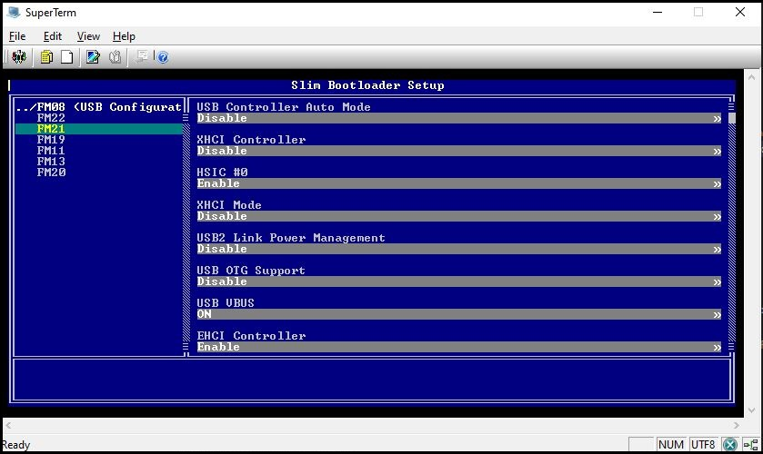
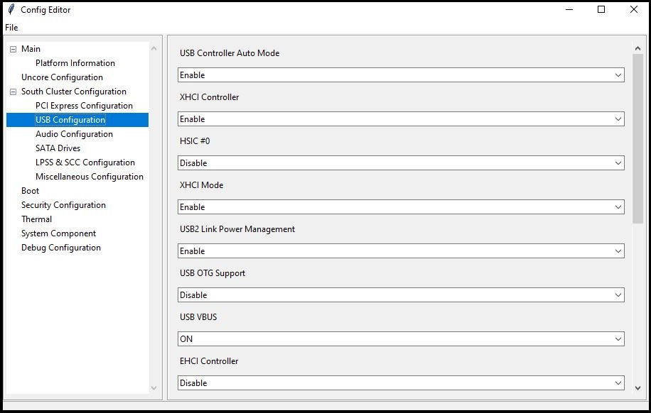

# Python Setup Browser for UEFI VFR

Demonstrate how to convert UEFI VFR setup into YAML format and browse on target or host.

# Steps:
- Run edksetup.bat

- Set PYTHON_HOME path to python3 dir path

  set PYTHON_HOME=C:\Python3

- Rebuid EDK2 BaseTools

  cd BaseTools

  toolsetup.bat forcerebuild

  cd ..

- Generate HPK and combined VFR files through EDK2 build

  build -p PayloadPkg\PayloadPkg.dsc -a IA32 -t VS2017

- Generate Setup YAML files
  mk.cmd

- Run setup broswer:

  On Target system, the setup browser can be launched through MicroPython environment.

    python Tools\SblSetup.py Build\Setup.json Build\Setup.yaml

  

  On Host system, the setup browser can be launched using stardard ConfigEditor GUI.

   python Tools\ConfigEditor.py
   then, load  Build\Setup.pkl file.

  

