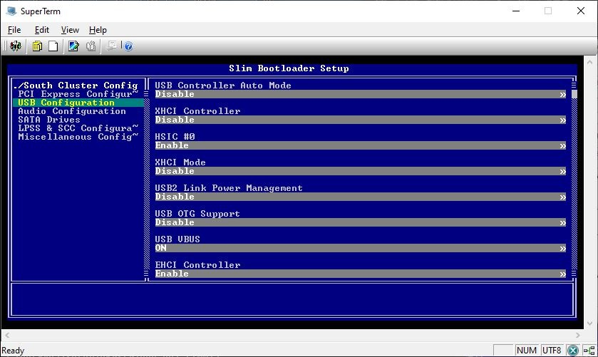

# Python Setup Browser for UEFI VFR

Demonstrate how to convert UEFI VFR setup into YAML format and browse setup options on target or host.

# Steps:
- Prepare required EDK2 build environment.
  Please adjust the TOOLCHAIN parameter accordingly in mk.cmd if required.

- Run "mk build" to generate HPK and combined VFR files.

- Run "mk setup" to generate Setup YAML files

- Run "mk run" to start setup browser GUI from host

  

- Or run "mk mpy" to start setup browser TEXT terminal from host

  Please follow instructions in mk.cmd to setup connection with PuTTY or other tools supporting named pipe terminal.

  

